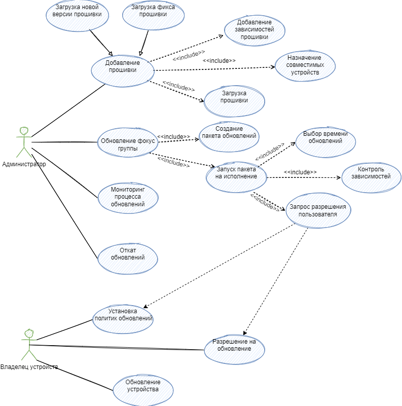
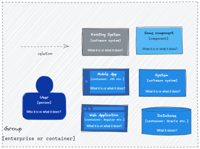
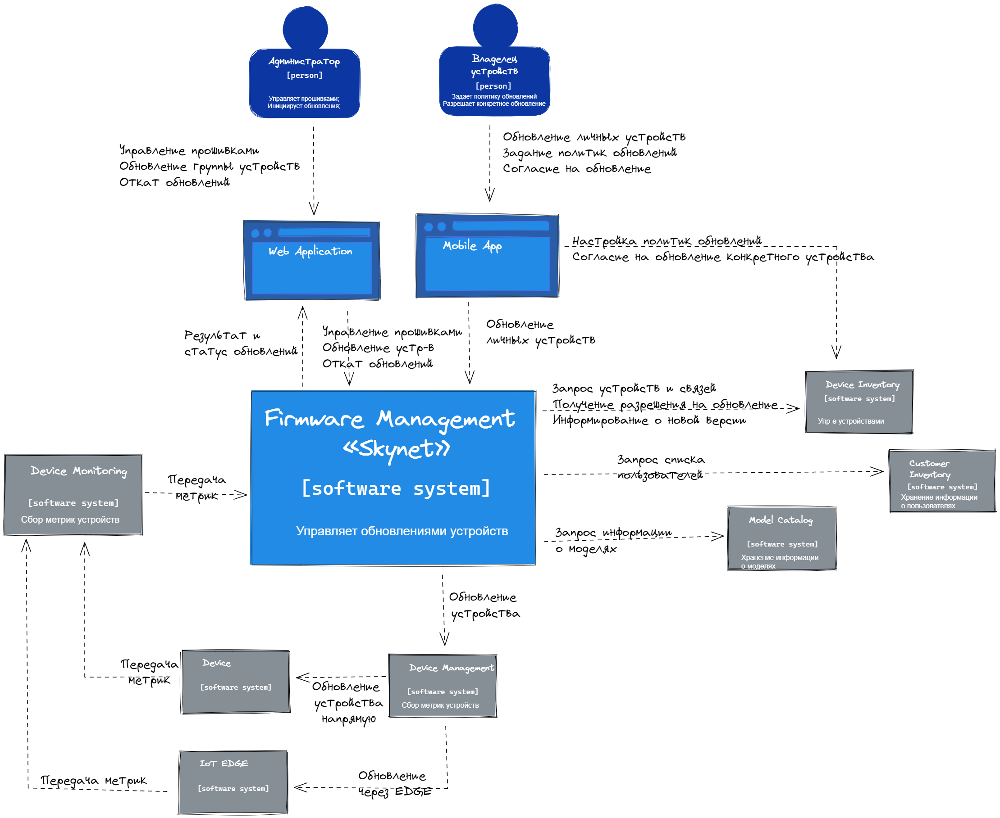
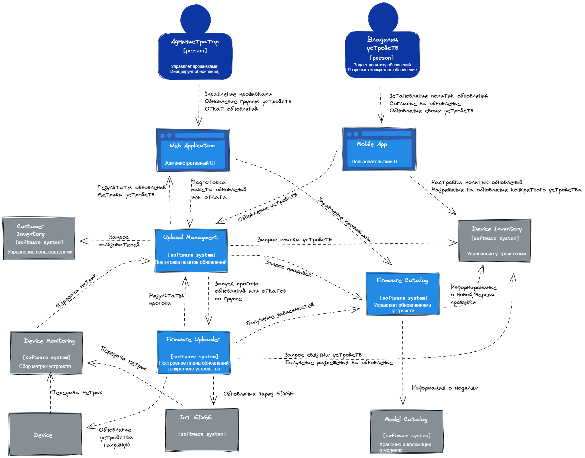

# MTS Kata "Firmware Management «Skynet»" от команды №5

- [Наша команда](#команда)
- [Вводные](#вводные)
- [Бизнес цели](#бизнес-цели)
- [Бизнес требования](#бизнес-требования) 
- [Сценарии](#сценарии)
- [Требования к системе](#требования-к-системе)
  - [Функциональные требования](#функциональные-требования)
  - [Атрибуты качества](#атрибуты-качества)
- [Архитектура](#архитектура)
  - [Контекст системы](#контекст-системы)
  - [Контейнерная диаграмма](#контейнерная-диаграмма)
 
## Команда
- Алан Кудухов alan.kuduhov@mts.ru 
- Илья Колесников igkolesn@mts.ru
- Марина Кондакова makondak@mts.ru
- Михаил Овчинников moovchi1@mts.ru
- Павел Григорьев pagrigorev@mts.ru
- Полина Шилова polina.shilova@mts.ru

## Вводные
Решение Умный дом/IoT - это не только разнообразные датчики, лампочки и розетки, но еще и устройства с установленными на борту прошивками (firmware). У каждого устройства есть прошивка со своим жизненным циклом, набором зависимостей и совместимостей с программно-аппаратной частью.

В кейсе рассматриваются следующие типы устройств:
- Умные роутеры – содержат ЦУД "сердце" Умного дома, к которому по протоколу ZigBee подключаются лампочки, розетки, пульты, реле управления и другие устройства
- Умные колонки – ассистент с функцией голосового помощника
- Цельсиум – автономные датчики параметров окружающей среды с возможностью отправлять данные по энергоэффективному протоколу NB-IoT

Мир не стоит на месте. Устройства постоянно совершенствуются, появляются новые функциональности, которые могут быть несовместимы с прошивками существующих девайсов. 
На фоне роста популярности темы Умного дома нам приходится обгонять конкурентов, обеспечивая стабильную работу сервисов и предлагая новые фичи. Поэтому необходимо обновлять прошивки уже существующих устройств и делать это крайне аккуратно. Например, обновить прошивку только на устройствах фокус-группы, чтобы прощупать интерес клиента. А при обновлении для массовых пользователей стоит о задуматься, в какое время суток обновление не создаст неудобств. Разумеется, нет ничего идеального, возможны ошибки, при которых придется экстренно и массово выкатывать хотфикс. Производство масштабируется, несколько фич-команд разрабатывают свои девайсы.
Мы планируем в обозримом будущем подключать по 15 тысяч устройств каждого типа на территории всей РФ. Размеры прошивок варьируются от 256кБ для Цельсиума до десятка-ов Мбайт (не более 128 МБ) для роутера и колонки. Цельсиум получает обновления пакетами по 512 байт в теле POST запроса.

### Задача
Необходимо спроектировать функциональность Firmware Management «Skynet», реализующую описанные бизнес-сценарии

## Бизнес цели
1. Обеспечить процесс обновления устройств для доставки новых бизнес-фич пользователям.
2. Предоставить возможность проводить канареечное тестирование новых бизнес фич, поставляемых вс прошивкой устройства.
3. Обновлять устройства не создавая дискомфорта пользователям.
4. Иметь возможность откатить обновления или быстро накатить фикс при обнаружении ошибок в новой версии прошивок.

## Бизнес требования
| #     | Описание                                                                                                                           |
|-------|------------------------------------------------------------------------------------------------------------------------------------|
| BR.01 |                                              |

## Сценарии
Ниже приведены архитектурно значимые сценарии.

## Требования к системе

### Функциональные требования

| #     | Система должна позволять                                                                         | Функциональный блок            |
|-------|--------------------------------------------------------------------------------------------------|--------------------------------|
| FR.01 | Администраторам загружать версии прошивок в каталог                                              | Управление прошивками          |
| FR.02 | Администраторам управлять фолксономиями версий прошивок                                          | Управление прошивками          |
| FR.03 | Администраторам настраивать связи между версиями прошивок                                        | Управление прошивками          |
| FR.04 | Администраторам просматривать информацию о прошивках                                             | Управление прошивками          |
| FR.05 | Администраторам управлять ЖЦ версии прошивки                                                     | Управление прошивками          |
| FR.06 | Системам получать информацию о выпуске новой версии прошивки                                     | Управление прошивками          |
| FR.07 | Администраторам создавать фокус группы для обновлений                                            | Управление пакетами обновлений |
| FR.08 | Администраторам создавать пакеты обновлений для фокус групп                                      | Управление пакетами обновлений |
| FR.09 | Просматривать информацию о прогрессе выполнения обновлений пакета                                | Управление пакетами обновлений |
| FR.10 | Администраторам настраивать правила для прерывания и автоматического отката обновлений пакета    | Управление пакетами обновлений |
| FR.11 | Администраторам отправлять пакет обновлений на исполнение                                        | Управление пакетами обновлений |
| FR.12 | Автоматически составлять план обновлений конкретного устройства                                  | Обновление прошивок            |
| FR.13 | Автоматически проверять зависимости прошивок                                                     | Обновление прошивок            |
| FR.14 | Автоматически проверять политики пользователя на обновление                                      | Обновление прошивок            |
| FR.15 | Автоматически запрашивать разрешение на обновление у пользователя, если это определено политикой | Обновление прошивок            |
| FR.16 | Выбирать время для обновления устройства                                                         | Обновление прошивок            |
| FR.17 | Обновлять прошивку на конкретном устройстве                                                      | Обновление прошивок            |
| FR.18 | Владельцам устройств обновлять просматривать доступные обновления                                | Управление устройствами        |
| FR.19 | Владельцам устройств обновлять прошивку на своем устройстве                                      | Управление устройствами        |
| FR.20 | Владельцам устройств настраивать политики обновлений устройств                                   | Управление устройствами        |
| FR.21 | Владельцам устройств разрешать обновление устройств, если пришел такой запрос                    | Управление устройствами        |
| FR.22 | Автоматически предлагать обновить устройство                                                     | Управление устройствами        |

### Атрибуты качества
Решения о ключевых атрибутах качества принималось на основании следующих данных:

| Метрика                                 | Текущее значение | Прогноз в горизонте год+ |
|-----------------------------------------|------------------|--------------------------|
| Количество типов устройств              | 3                | 4 (+25%)                 |
| Количество моделей                      | 3                | 4  (+25%)                |
| *Количество устройств*                  | *45 000*         | *180 000  (+300%)*       |
| Объем одной прошивки                    | 256kb - 128Mb    | 256kb - 128Mb  (+0%)     |
| Прирост версий прошивок в год по модели | 12               | 12  (+0%)                |

После анализа метрик и вводных были выделены следующие архитектурно значимые 

| #     | Атрибут качества      | Обоснование                                                                                                                                                                                                                                                                                                                                                                                 |
|-------|-----------------------|---------------------------------------------------------------------------------------------------------------------------------------------------------------------------------------------------------------------------------------------------------------------------------------------------------------------------------------------------------------------------------------------|
| AR.01 | 	Масштабируемость     | 	Со временем объём хранимых в системе данных будет увеличиваться. Будет расти количество устройств и количество хранимых прошивок. Также при росте количества поддерживаемых моделей устройств будет значительно  расти количество связей между прошивками                                                                                                                                  |
| AR.02 | 	Эластичность         | 	В разные периоды времени количество одновременно обновляемых устройств разное. Например, сразу после при выхода новой версии прошивки в публичный доступ, количество обновлений будет значительно выше, чем в другое время                                                                                                                                                                 |
| AR.03 | 	Устойчивость к сбоям | 	С системой взаимодействуют множество пользователей, преследующих свои цели. Проблема с одним из функциональных блоков не должны блокировать работу других пользователей.                                                                                                                                                                                                                   |
| AR.04 | 	Эволюционируемость   | 	На этапе количество реализуемых функций может быть небольшим. Но система должна позволять добавлять новую функциональность эволюционно. Также развитии системы могут меняться используемые технологии. Например при росте количества пошивок геометрически растет количетво связей между прошивками и со временем для хранения связей может потребоваться переход на другой тип хранилища. |
| AR.05 | 	Гибкость             | 	Сейчас разными устройствами занимаются разные команды. Предполагается, что такой подход должен быть перенесен на проектирование "Firmware Management «Skynet»"                                                                                                                                                                                                                             |

### ADR
| #      | Описание                                                                                                                                                                                                                                                                                                               |
|--------|------------------------------------------------------------------------------------------------------------------------------------------------------------------------------------------------------------------------------------------------------------------------------------------------------------------------|
| ADR.01 | В проекте будем использовать практику ведения Architecture Decision Records                                                                                                                                                                                                                                            |
| ADR.02 | Система будет проектироваться с учетом стратеги Product Business Capability                                                                                                                                                                                                                                            |
| ADR.03 | 1. Проектируемая система (как совокупность capability) строится по принципам event-driven архитектуры;   2. Каждая capability может проектироваться в своем стиле, но основная рекомендация - использование микросервисной архитектуры.  Подробнее в [ADR.03 Выбор архитектурного стиля](../ADRs/ADR03ArchStyle.md) |
| ADR.04 |                                                                                                                                                                                                                                                                                                                        |

## Архитектура

### Легенда

### Контекст системы

### Контейнерная диаграмма
