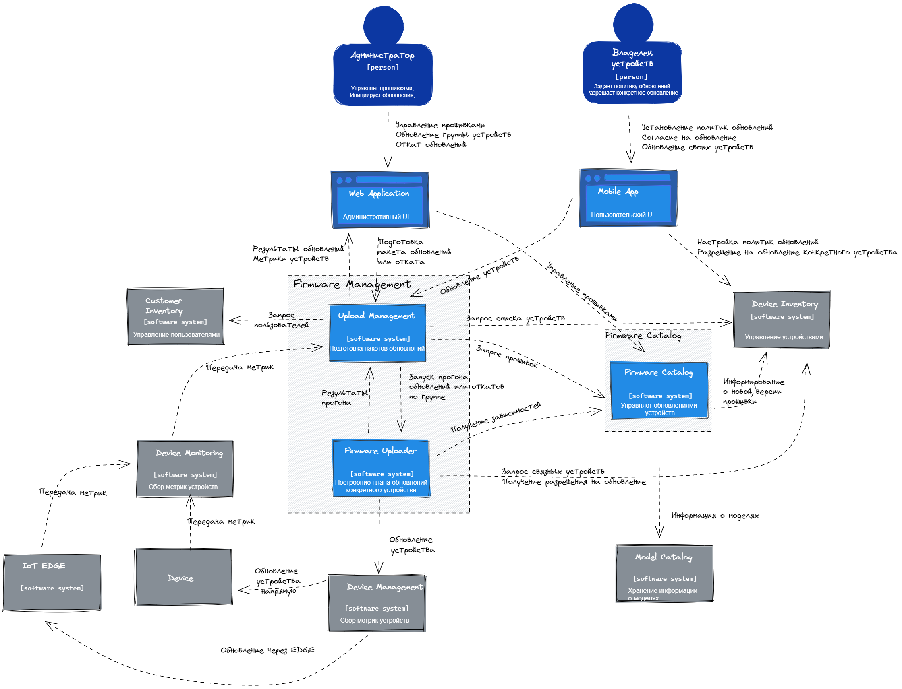

# MTS Kata "Firmware Management «Skynet»" от команды №5

- [Наша команда](#команда)
- [Вводные](#вводные)
- [Бизнес цели](#бизнес-цели)
- [Бизнес требования](#бизнес-требования) 
- [Сценарии](#сценарии)
- [Архитектура](#архитектура)
    -   [Контекст системы](#контекст-системы)
 

## Команда

## Вводные

## Бизнес цели

## Бизнес требования
| #     | Описание                                                                                                                           |
|-------|------------------------------------------------------------------------------------------------------------------------------------|
| BR.01 |                                              |

## Сценарии
Ниже приведены архитектурно значимые сценарии.

## Требования к системе

### Функциональные требования

| #     | Cистема должна позволять                                                               | Функциональный блок                |
|-------|----------------------------------------------------------------------------------------|------------------------------------|
| FR.01 | пользователям регистрироваться и авторизовываться в системе                            | Управление ролями и пользователями |
|  
### Атрибуты качества
| #     | Атрибут качества      | Обоснование                                                                                                                        |
|-------|-----------------------|------------------------------------------------------------------------------------------------------------------------------------|
| AR.01 | 	Масштабируемость     | 	Со временем объём хранимых в системе данных будет увеличиваться. Будет расти количество устройств и количество хранимых прошивок. |

## Архитектура

### Легенда

### Контекст системы

### Контейнерная диаграмма
